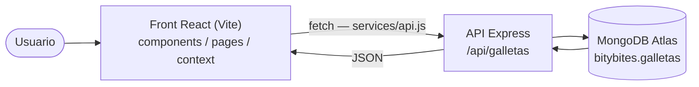

# Bity Bites 🍪 — Frontend (PEC 4)

Interfaz en **React (Vite)** para la tienda de galletas Bity Bites. Consume la API REST de la PEC 3 (Node + Express + MongoDB). Permite **listar, crear, editar y eliminar** galletas.

- **API (PEC 3):** https://bity-bites-api.vercel.app · repo: `bity-bites-api`
- **Front desplegado:** https://bity-bites-front.vercel.app

## Requisitos
- Node.js 18+
- La API de la PEC 3 en marcha (local en `http://localhost:4000` o la desplegada en Vercel)

## Variables de entorno
Crear un fichero `.env` en la raíz del front (hay un `.env.example` de plantilla):

```
VITE_API_URL=http://localhost:4000/api
```

En producción (Vercel), poner `VITE_API_URL=https://bity-bites-api.vercel.app/api`.

## Instalar y ejecutar

**Front (esta carpeta):**
```bash
npm install
npm run dev
```
Abre `http://localhost:5173`.

**Back (carpeta `pec3-api`):**
```bash
npm install
node index.js
```
La API arranca en `http://localhost:4000`.

## Endpoints usados
| Método | Ruta | Uso en el front |
|---|---|---|
| GET | `/api/galletas` | Listar galletas (al cargar) |
| POST | `/api/galletas` | Crear galleta (formulario) |
| PUT | `/api/galletas/:id` | Editar galleta |
| DELETE | `/api/galletas/:id` | Eliminar galleta |

## Flujo de la app



## Estructura
```
src/
  components/   GalletaCard, FormularioGalleta
  pages/        Inicio
  context/      GalletasContext (estado global)
  services/     api.js (llamadas a la API, URL en variable de entorno)
  App.jsx       estado global + Provider
```

## Stack
React · Vite · Fetch API · Context API · MongoDB (vía la API) · Vercel
